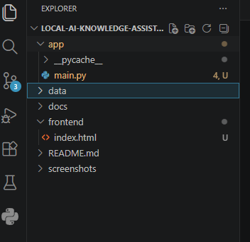
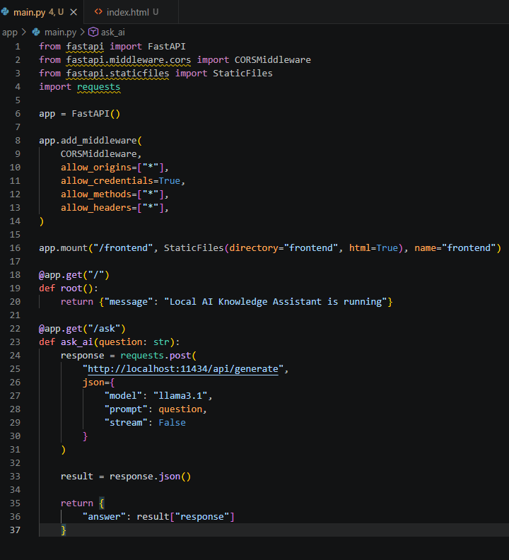
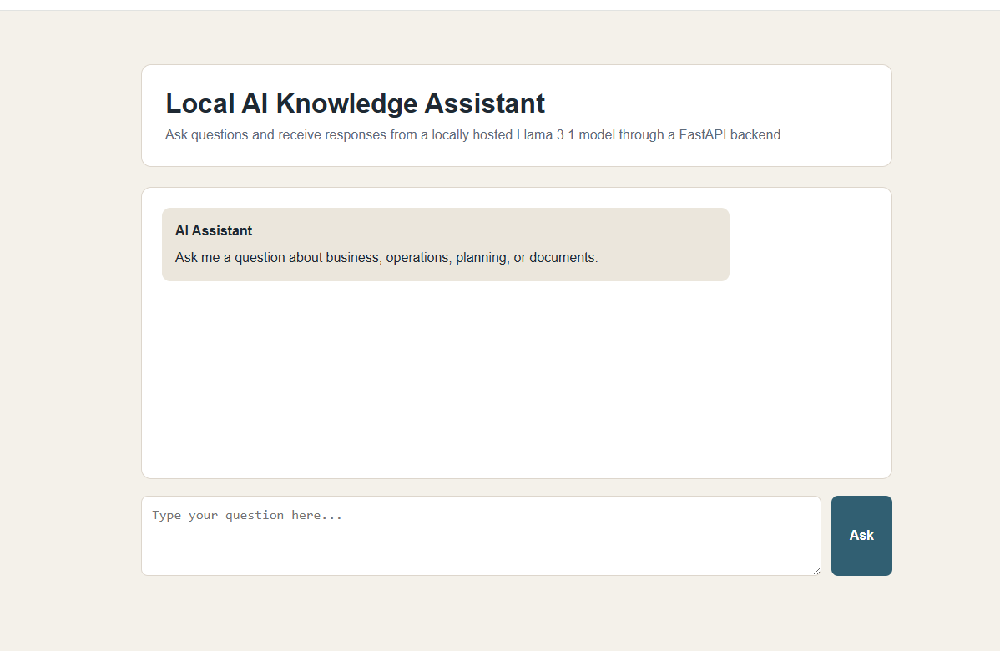
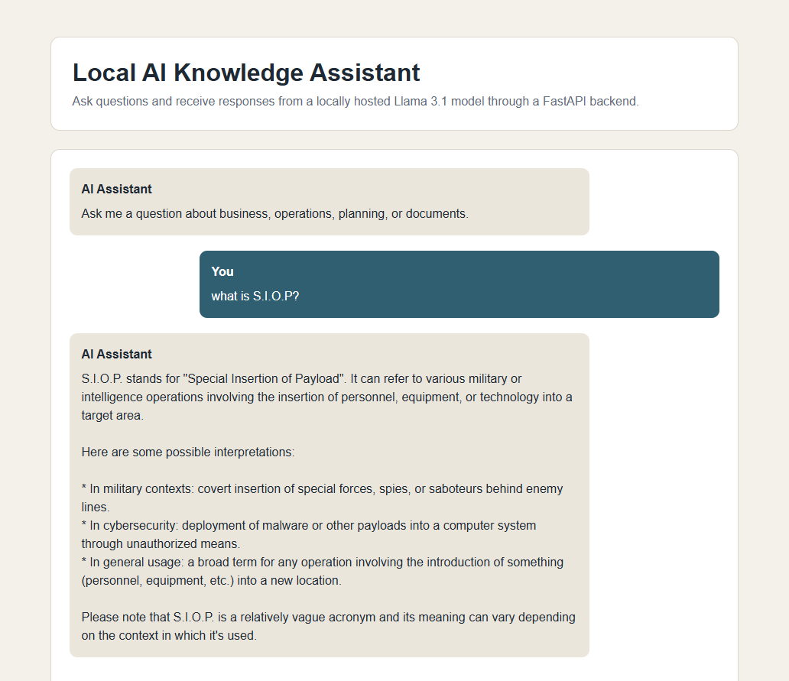
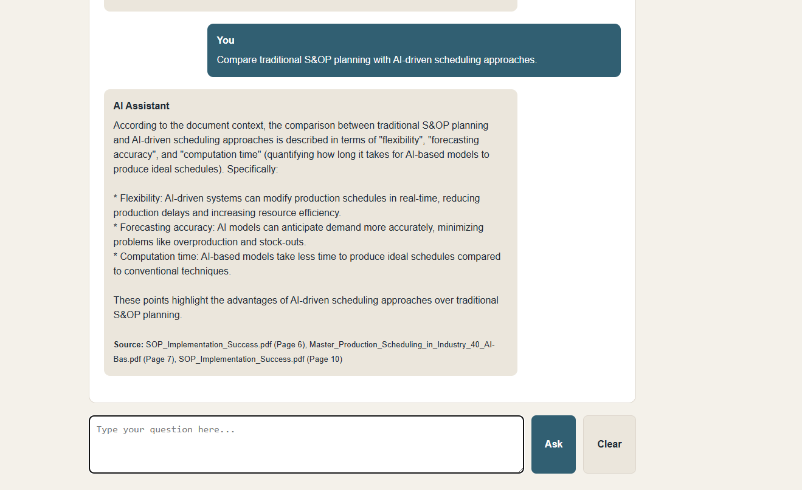

# Local AI Knowledge Assistant

A locally hosted AI assistant built with FastAPI, Ollama, and Llama 3.1.

This project allows users to ask questions through a web-based chat interface and receive responses from a locally running large language model without relying on cloud-based AI services.

---

## Features

- Local Llama 3.1 inference using Ollama
- FastAPI backend
- Web-based chat interface
- Real-time AI responses
- Enter-to-send functionality
- Clear chat functionality
- GitHub version control

---

## Technology Stack

- Python
- FastAPI
- Ollama
- Llama 3.1
- HTML
- CSS
- JavaScript
- Git
- GitHub

---

## Architecture

User Question

↓

Frontend (HTML/CSS/JavaScript)

↓

FastAPI Backend

↓

Ollama API

↓

Llama 3.1

↓

Response Returned to User

---

## Screenshots

### Project Structure



### FastAPI Backend



### Running Application



### AI Response Example



---

## Running Locally

Clone the repository:

```bash
git clone https://github.com/Psmith1358/local-ai-knowledge-assistant.git
```

Install dependencies:

```bash
pip install fastapi uvicorn requests
```

Start Ollama:

```bash
ollama run llama3.1
```

Start FastAPI:

```bash
python -m uvicorn app.main:app --reload
```

Open:

```text
http://127.0.0.1:8000/frontend
```

---
## Retrieval-Augmented Generation (RAG)

The Local AI Knowledge Assistant now supports Retrieval-Augmented Generation (RAG), allowing users to ask questions about uploaded documents and receive grounded responses based on document content rather than general AI knowledge.

### RAG Workflow

```text
PDF Document
↓
Text Extraction
↓
Document Chunking
↓
Sentence Embeddings
↓
FAISS Vector Database
↓
Semantic Search
↓
Llama 3.1 (Ollama)
↓
Answer + Source Citations
```
### Example Response

### Example Response

#### Multi-Document RAG with Source Citations



The assistant retrieves relevant information from uploaded documents using semantic search and FAISS vector retrieval. Responses are generated by Llama 3.1 and include source citations to improve transparency and traceability.

## Future Enhancements

- Multi-document knowledge base
- PDF upload interface
- Document management dashboard
- Source document citations
- Conversation memory
- User authentication


### Features

* PDF document ingestion
* Semantic search using FAISS
* Local embeddings using Sentence Transformers
* Grounded responses from document context
* Source page citations
* Fully local execution with Ollama and Llama 3.1

### Example Response


---

## Author

Payton Smith

Master of Science in Information Systems
Certificate in AI for Business